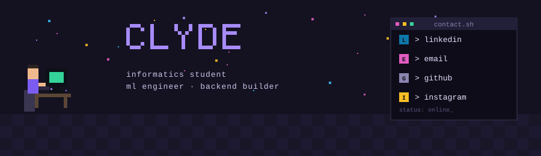
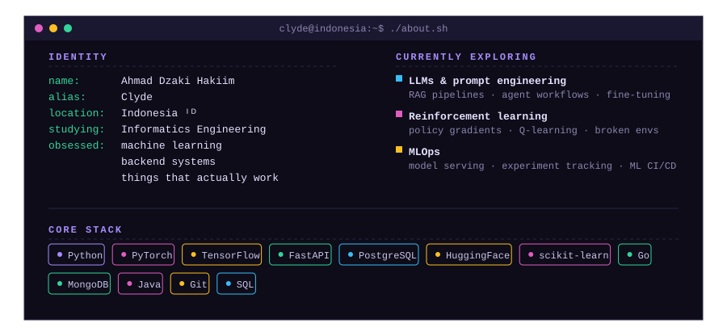
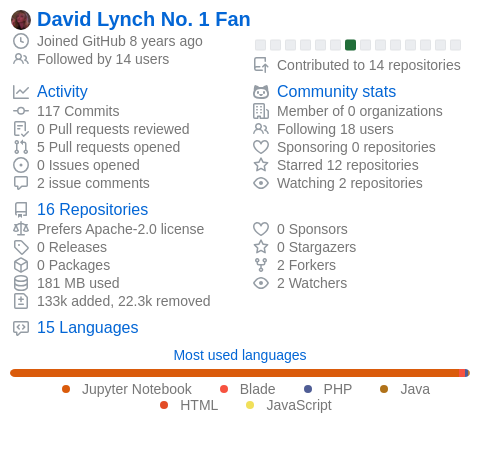

<!--  hey, you read the source. respect. 👾  -->

<div align="center">

<!--
  Pixel art banner. Committed at: assets/pixel-banner.svg
  Swap the src below to your repo's raw path once pushed, e.g.:
  https://raw.githubusercontent.com/Clydeew/Clydeew/main/assets/pixel-banner.svg
-->


<br/><br/>

[](https://git.io/typing-svg)

</div>

<div align="center">

<sub>the pixel panel above is art — these badges are the clickable ones 👇</sub>

<br/>

[](https://www.linkedin.com/in/ahmad-dzaki-hakiim-fadhlurrohman-72b9a0269/)
[](mailto:ahmaddzaki195@gmail.com)
[](https://github.com/Clydeew)
[](https://www.instagram.com/c.ahmad_dzhf/)

</div>

<div align="center">

</div>

<br/>

## ✦ &nbsp;`~/about`

<div align="center">

<!--
  Single consolidated card — identity, current focus, and stack.
  Committed at: assets/profile-card.svg
-->


</div>

<div align="center">

</div>

## ✦ &nbsp;`~/selected_projects`

<table border="0" width="100%">
<tr>
<td width="50%" valign="top">

### 🌐 &nbsp;Full-Stack

**`OceanBridge`** &nbsp;🌊&nbsp; [`repo →`](#)

> A web-based e-commerce platform connecting local fishermen directly with consumers — built to digitalize Indonesia's blue economy. Features a modern glassmorphism UI, a seller dashboard, admin panel, and smart dynamic navigation.

`Laravel 11` `Tailwind CSS` `Alpine.js` `Vite` `PHP`

---

### 🧠 &nbsp;ML / AI

**`Automated Dental Age Estimation`** &nbsp;🦷&nbsp; [`repo →`](#)

> Two-stage deep learning pipeline for forensic dental age estimation. YOLOv8 detects and crops individual teeth from panoramic X-rays; EfficientNetB0 then regresses chronological age. Achieved **MAE of 1.97 years** on ages 9–19.

`Python` `YOLOv8` `EfficientNet` `TensorFlow` `Keras` `OpenCV`

</td>
<td width="50%" valign="top">

### 📊 &nbsp;Data Science

**`England & Wales Housing Price Drivers`** &nbsp;🏠&nbsp; [`repo →`](#)

> Analyzed residential property price drivers using HM Land Registry, ONS population, and geospatial boundary data. Built and compared 5 regression models — XGBoost achieved best log-scale R² of **0.695**. Key finding: location is the dominant price driver.

`Python` `XGBoost` `LightGBM` `scikit-learn` `Pandas` `Seaborn`

</td>
</tr>
</table>

<div align="center">

</div>

## ✦ &nbsp;`~/activity`

<div align="center">

<!-- Works straight off this URL — no GitHub Action or extra branch needed. -->


</div>

## ✦ &nbsp;`~/stats`

<div align="center">

<!--
  Auto-updating PNG, generated by a scheduled GitHub Action (see below) —
  no third-party hosted service, no manual edits, refreshes itself daily.
-->


</div>

<div align="center">

</div>

<div align="center">

```
$ echo "design the architecture. train the model. ship the system. then iterate."
```


<br/>
